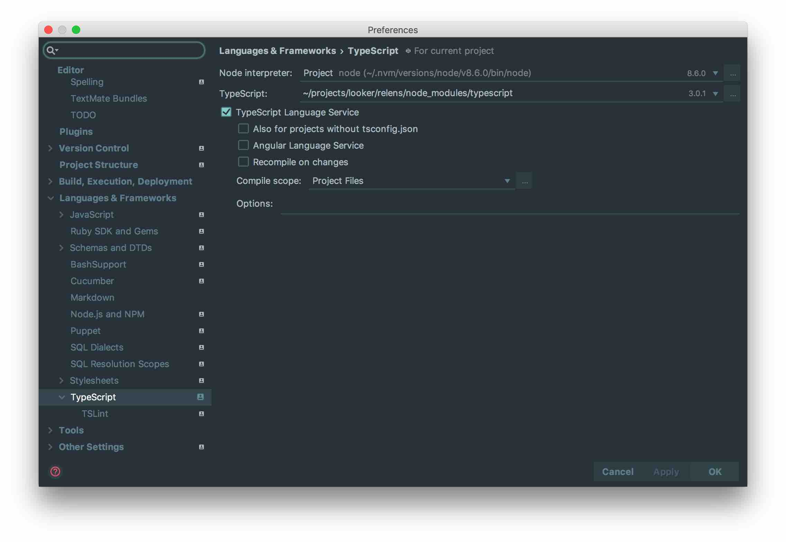
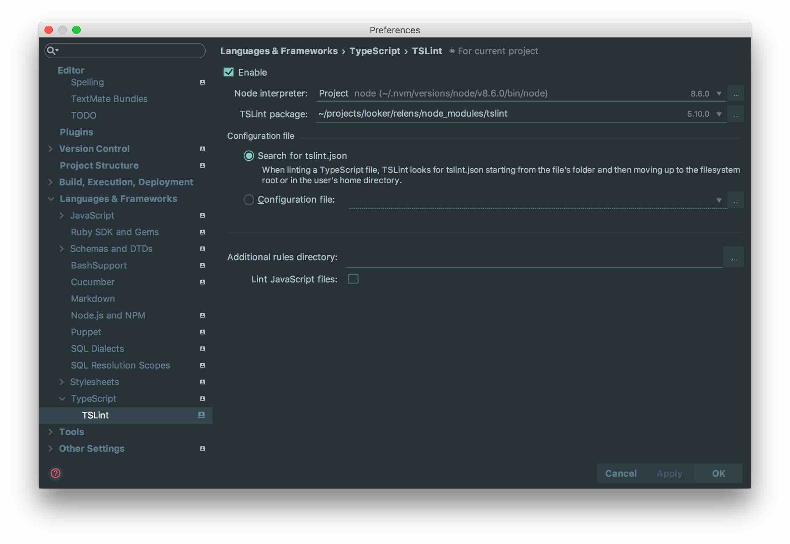
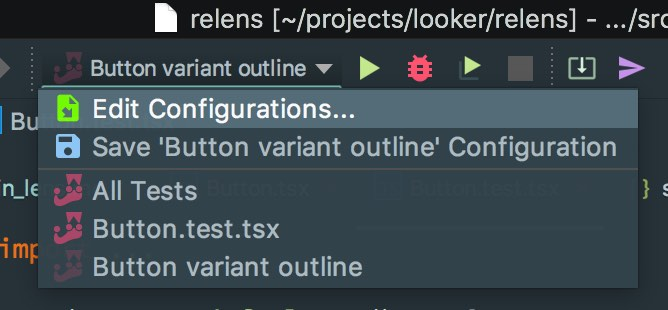
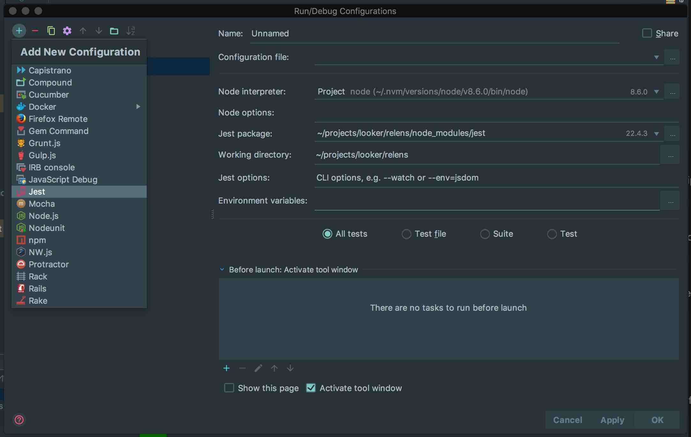
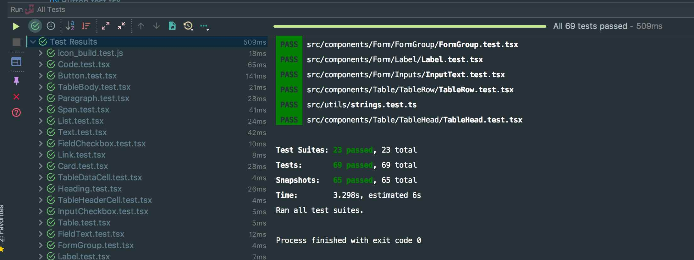
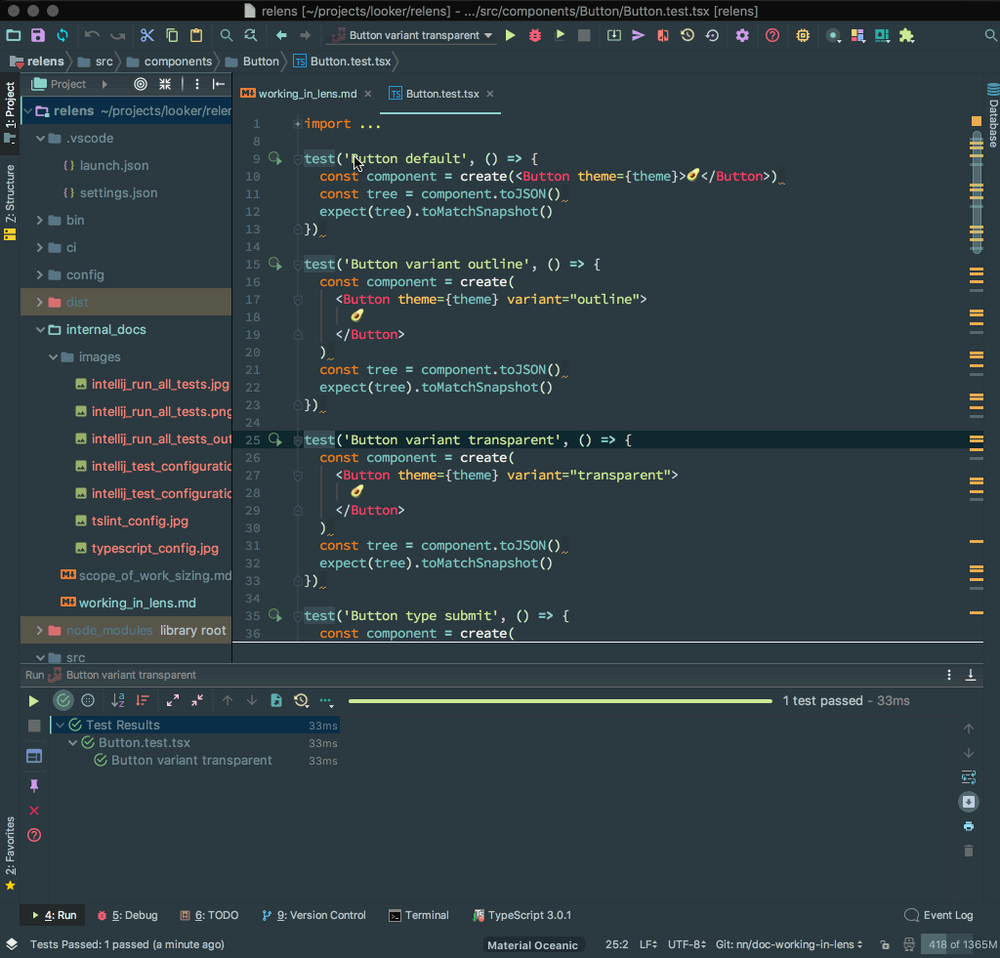

# Working in Lens

## Code Style Philosophy

#### Automate code formatting and correctness whenever possible

Lens takes the perspective that, as much as possible, code style (code formatting, alignment, interchangeable idioms, etc) should be dictated by automated tooling. This means tooling that can statically analyze code and actually rewrite it, either for the purpose of consistent formatting or correctness. This approach not only saves time by eliminating arguments about preferred code styles, it also reduces arbitrary diff noise for code reviewers, and decreases an engineer's overhead needed to keep code consistent with a code style or linter.

#### Use lint rules to eliminate dangerous anti-patterns

When automated tooling cannot reformat code without causing logical errors, Lens employs linter rules to ensure it produces consistent, correct code. An example of one of these rules is the TSLint `no-namespace` rule. Namespacing, while a valid feature in Typescript, is the byproduct of Typescript evolving during a time when ES6 style modules did not exist (nor did the tooling around them). [Typescript itself calls out the best approach to code organization moving forward](https://www.typescriptlang.org/docs/handbook/namespaces-and-modules.html#using-modules):

> Starting with ECMAScript 2015, modules are native part of the language, and should be supported by all compliant engine implementations. Thus, for new projects modules would be the recommended code organization mechanism.

To ensure Typescript namespaces are never introduced into Lens (because it uses ES6 modules), Lens defines the linter rule `no-namespace` to enforce code correctness.

## Automated Tooling

Lens ships with a few code tools baked into the Lens component authoring workflow:

### [Prettier](https://prettier.io/)

Prettier simply reformats code. It has few options, intentionally, to eliminate discussion about how to configure those options.

### [TSLint](https://palantir.github.io/tslint/)

TSLint is the Typescript standard linting tool. It comes with a `--fix` flag which can fix many of the errors it finds.

### [Stylelint](https://stylelint.io/)

Stylelint lints the CSS code in the app.

### Using the tooling

The majority of the time, using these tools should be transparent as they are hooked into a fast pre-commit hook that is enabled for all developers. If one of the lint or prettier steps fail during the pre-commit hook you'll have to fix the error before committing.

You can also configure some editors to apply their formatting on save, this is discussed in a different section below. Sometimes, however you might want to run each command manually. Below is a list of the available commands:

`yarn <command>`

- **lint** Runs all of the linters in order
- **lint:ts** Lint all of the Typescript files, including tests
- **lint:css** Lint all of the CSS, including inlined CSS
- **prettify** Run Prettier on all relevant files

## Editor Support & Configuration

As Lens is predominately written in Typescript, the two best supported IDEs for working in Lens are VS Code and Intellij (or derivatives).

### VS Code

A [settings.json](.vscode/settings.json) file is checked into the Lens repository, which contains some required settings for VS Code.

Additionally a simplistic [launch.json](.vscode/launch.json) file is also included which should allow developers to quickly run and debug tests locally, through the Jest test runner. [This file is based off of the recommendations here](https://github.com/Microsoft/vscode-recipes/tree/master/debugging-jest-tests).

#### Running Tests

1.  Go to the "Debug" panel in VS Code
2.  In the top left choose either "Jest All" or "Jest Current File"
3.  Click the Play button

#### Strongly Recommended Plugins

- [Styled Components](https://github.com/styled-components/vscode-styled-components) enables sytax highlighting and intellisense for inline CSS.
- [TSLint](https://github.com/Microsoft/vscode-tslint) enables inline linting and fixing of code on save

#### Very Helpful Plugins

- [Spell Check](https://github.com/Jason-Rev/vscode-spell-checker) enables spell checking in code
- [Colorize](https://github.com/kamikillerto/vscode-colorize) displays known colors (string values, hex, rgb, etc) as their actual color value
- [Prettier](https://github.com/prettier/prettier-vscode) enables Prettier code formatting on save
- [Rewrap](https://github.com/stkb/Rewrap) wraps comments at the 80 character column mark automatically
- [Sort Lines](https://github.com/Tyriar/vscode-sort-lines) quickly resort lines of code

### Intellij

Intellij comes mostly setup for working with Typescript out of the box, however you'll want to configure a few things and install a few recommended plugins to get the most out of your Lens coding experience.

#### Configuring Typescript

In preferences `(Cmd + ,)` find "Languages & Frameworks" > Typescript. Ensure your configuration looks like the following screenshot:

#### Configuring TSLint

In preferences `(Cmd + ,)` find "Languages & Frameworks" > Typescript > TSLint. Ensure your configuration looks like the following screenshot:

#### Running Tests

Intellij should automatically detect Jest tests and provide inline test running tools. Creating a task to run all tests requires a few extra steps.

##### Run all tests

1. Create a new test configuration by selecting "Edit Configurations...":
    
1. Click the `+` icon in the top left and choose "Jest":
    
1. Name the configuration something like "All tests" and click "OK".
1. Click the play button (or debug button) to run all the tests:
    
1. Your output should look something like:
    

##### Run an individual test

#### Strongly Recommended Plugins

- [Intellij Styled Components](https://github.com/styled-components/webstorm-styled-components) enables syntax highlighting and typeahead for inline CSS
